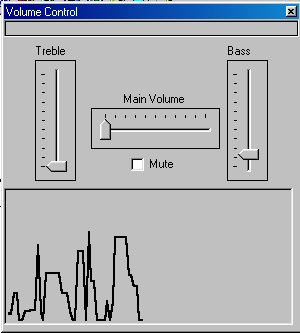



## Volume Control

### Description

This program displays a visual equalizer and a volume control for the main volume and the bass and treble. Have to see it! Please Vote!
 
### More Info
 

             |
---                |---
**Submitted On**   |1998-01-04 17:41:58
**By**             |[Mike Breault](https://github.com/Planet-Source-Code/PSCIndex/blob/master/ByAuthor/mike-breault.md)
**Level**          |Intermediate
**User Rating**    |4.7 (42 globes from 9 users)
**Compatibility**  |VB 5\.0, VB 6\.0
**Category**       |[Sound/MP3](https://github.com/Planet-Source-Code/PSCIndex/blob/master/ByCategory/sound-mp3__1-45.md)
**World**          |[Visual Basic](https://github.com/Planet-Source-Code/PSCIndex/blob/master/ByWorld/visual-basic.md)
**Archive File**   |[CODE\_UPLOAD14489232001\.zip](https://github.com/Planet-Source-Code/mike-breault-volume-control__1-14978/archive/master.zip)

